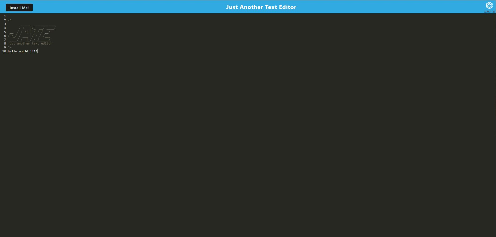

# Text Editor

## Description

My motivation to build this project was to gain an understanding of progressive web applications (PWAs).  I wanted to be able to understand service workers, caching, webpack, Indexed DB, and dists.  I built this project so that I could gain experience with using caching, webpack, and service workers and dists, as well as Indexed DB.  This project solves the problem of an employee at a company needing a simple text editing application to be able to do something like keep track of notes.  The user can even use this application if his or her internet connection goes down, since it can be installed on the desktop.  For this project, I learned how to create a PWA, and I also learned something about how to use service workers and caching. I took starter code that OSU gave and added to it to create this application.

## Table of Contents (Optional)

This README isn't that long, so N/A.

## Installation

This application has been deployed to Heroku.  To use it, you can follow the link in the Usage section below.  To install the application on your desktop, click the **Install Me!** button in the top right of the application.  If this button doesn't appear, that means the application has already been installed on your computer.

## Usage

To use the deployed application, please use the following link: [https://stark-sierra-04496-744a2982c68e.herokuapp.com/](https://stark-sierra-04496-744a2982c68e.herokuapp.com/).  Here is a screenshot of the application: 

 To use the text editor, type some text into it, click out of the editor window, and then close the text editor.  When you open the application up again, the text will be saved there, just as you left it.  You can also install the text editor to the desktop by following the instructions in the Installation section above.  If you disconnect from the internet, the application will still function and save text properly.

## Credits

I used code from the activities for Module 19 in order to write the text editor.  I also used the Xpert Learning Assistant AI chatbot to help out with writing some of the code.  I used code from an internet tutorial on precaching, which can be found here: [https://developer.chrome.com/docs/workbox/caching-resources-during-runtime](https://developer.chrome.com/docs/workbox/caching-resources-during-runtime), in my src-sw.js file.

## License

This project is under an MIT License.  Please see the license in the GitHub repository for more information.

## Badges

I don't have any noteworthy badges to display.

## Features

This project is a text editor that functions as a PWA and can thus be installed on the desktop.  It takes text input from the user and saves it, so that when the user closes the application and reopens it, the text remains as the user left it.  This application can also function without an internet connection.

## How to Contribute

This was a project I personally completed, so N/A.

## Tests

N/A
